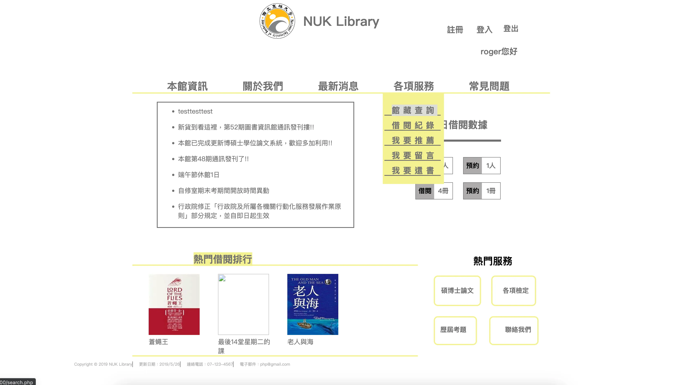

> 這個大學專案的重啟過程紀錄有寫成文章，有興趣的可以去看看順便給個 👏～
> 
> [擺脫惱人環境：用 Docker 重拾大學專案](https://medium.com/@rogerchang7904/%E6%93%BA%E8%84%AB%E6%83%B1%E4%BA%BA%E7%92%B0%E5%A2%83-%E7%94%A8-docker-%E9%87%8D%E6%8B%BE%E5%A4%A7%E5%AD%B8%E5%B0%88%E6%A1%88-c82d9f87eba0)☁️🎉

<br />
<p align="center">
    <a href="[https://appwrite.io](https://medium.com/@rogerchang7904/%E6%93%BA%E8%84%AB%E6%83%B1%E4%BA%BA%E7%92%B0%E5%A2%83-%E7%94%A8-docker-%E9%87%8D%E6%8B%BE%E5%A4%A7%E5%AD%B8%E5%B0%88%E6%A1%88-c82d9f87eba0)" target="_blank"></a>
    <br />
    <br />
    <b>圖書資訊系統功能</b>
    <br />
    <b>功能：管理員模式、查詢館藏、借還書籍、預約書籍、email提醒、熱門書籍、統計資料</b>
    <br />
    <br />
</p>

[]([https://img.shields.io/badge/version-v1.1.0-blue](https://img.shields.io/badge/Language-PHP-orange)) 
[](https://img.shields.io/badge/docker-blue) 

## 安装

使用 docker-compose 在 localhost 運行

### Unix

```bash
# 構建並啟動容器，讓容器在背景執行。
docker-compose up --build -d
# 將本地的 SQL 腳本檔案（php.sql）複製到名為 mysql-server 的容器中的根目錄。
docker cp sql/php.sql mysql-server:/php.sql
# 進入運行中的 mysql-server 容器，並啟動 bash shell 以進行互動操作。
docker exec -it mysql-server bash
# 使用 roger 用戶身份連接到 MySQL 服務。執行後將提示輸入密碼。
mysql -u roger -p
# 在 MySQL 中選擇 phpproject 資料庫作為當前資料庫。
mysql> use phpproject;
# 執行先前複製到容器中的 SQL 腳本（php.sql），這通常包含建立資料表和初始化資料的 SQL 命令。
mysql> source php.sql
```

運行後到 http://localhost:9000/library.php 就可以看到首頁了

### Dockerfile
```bash
# Dockerfile
# 從 PHP 的 Apache 映像檔作為基礎來建立。
FROM php:5.6-apache

# 將本地目錄中的 ./project 資料夾複製到容器的 /var/www/html 目錄中。用於檔案放到 Apache 伺服器的根目錄。
COPY ./project /var/www/html
# 更新容器的套件列表，並安裝 GD 庫的相關依賴，用於處理圖片。
# 在安裝完成後，刪除 apt 套件列表以減少映像檔的大小。
RUN apt-get update && apt-get install -y \\
    libfreetype-dev \\
    libjpeg62-turbo-dev \\
    libpng-dev \\
&& rm -rf /var/lib/apt/lists/* \\
    && docker-php-ext-configure gd --with-freetype --with-jpeg \\
    && docker-php-ext-install -j$(nproc) gd
# 將 PHP 的設定檔從生產環境的版本複製到使用中的設定檔中。這通常包含了生產環境下推薦的設定。
RUN mv "$PHP_INI_DIR/php.ini-production" "$PHP_INI_DIR/php.ini"
# 安裝 PDO、PDO_MySQL 和 MySQLi 擴展。這些擴展允許 PHP 透過 PDO 或 MySQLi 來與 MySQL 數據庫進行互動。
RUN docker-php-ext-install pdo pdo_mysql mysqli
# 啟用 Apache 的 rewrite 模組，該模組允許使用 .htaccess 檔案來重寫 URL，常用於乾淨的 URL 和網站的路由功能。
RUN a2enmod rewrite
# 設定容器以 www-data 用戶身份運行。這是一個安全性最佳實踐，有助於限制容器進程的權限。
USER www-data
```

### compose.yaml
```bash
# compose.yaml
services:
  server:
    # 指定要建立這個服務的 Docker 映像檔。這裡使用當前目錄 (.) 的 Dockerfile。
    build:
      context: .
    # 將容器的 80 端口映射到主機的 9000 端口
    ports:
      - 9000:80
    # 定義該服務依賴的其他服務
    depends_on:
      - db
  # 定義名為 "db" 的 contanier。
  db:
    # 使用 Docker Hub 上的官方 MySQL 映像檔。
    image: mysql==5.4.7
    # 設置一個名稱，這在後面會用到，要進入 mysql server 匯入資料。
    container_name: mysql-server
    # 使用 MySQL 5.7 版本默認的身份驗證插件。
    command: --default-authentication-plugin=mysql_native_password
    # 設置容器在結束後自動重啟。
    restart: always
    # 設置環境變量，通常用於配置數據庫的用戶名、密碼、數據庫名等。
    environment:
      ...
    # 將容器的 3306 端口映射到主機的 3307 端口
   # 這邊因為 3306 已經被我的 localhost 用掉了，所以隨便設一個別的。
    ports:
      - "3307:3306"
```

### docker-compose up --build 大概會做幾件事：

- 讀取配置檔案：Docker Compose 首先讀取 docker-compose.yaml（或 yml）檔案，這個檔案包含了定義和配置多容器 Docker 應用所需的所有信息。
- 建立映像檔：對於配置中指定了 build 上下文的服務，Docker Compose 會根據指定的 Dockerfile 建立 Docker 映像檔。如果映像檔已存在並且沒有更改，則會跳過此步驟。
- 創建網絡：如果配置中指定了網絡，Docker Compose 會創建一個網絡，以便容器之間可以相互通信。
- 啟動容器：根據配置檔案中的設定，Docker Compose 會創建並啟動所有定義的服務（容器）。這包括設置網絡、掛載卷、設置環境變量等。
- 依賴性管理：如果某個服務依賴於其他服務（如使用 depends_on 指令），Docker Compose 會確保按照依賴順序啟動服務。
- 日誌輸出：Docker Compose 會捕獲並在終端顯示所有容器的輸出（stdout 和 stderr），讓你能夠實時查看容器的日誌信息。
